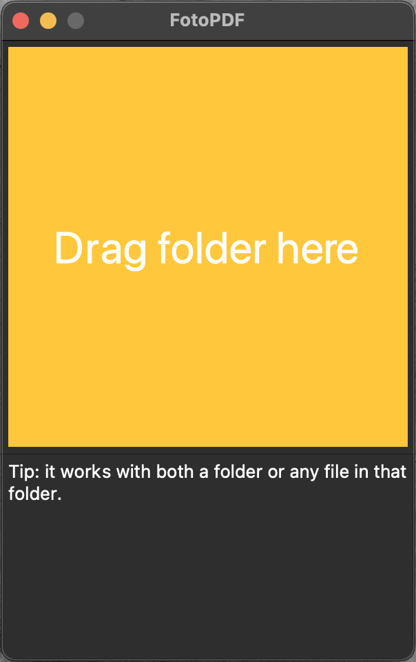

# FotoPDF

## GUI (default)


Drag and drop the folder containing the images and `settings.json` on the application window. Images will be included in alphabetical order.

Dropping any file from that folder has the same effect. Only the folder is considered.


## Command line (you'll need to set the flag GUI to False)
As Python script:

    python3 FotoPDF <folder-where-images-and-settings.json-are>
    
As executable:

    ./FotoPDF <folder-where-images-and-settings.json-are>
    
## Settings (settings.json)
This file is specific to the PDF to generate and must be placed in the same folder where the images are.

If no settings.json is found, a default one will be created. You will the have to customize it as necessary.

## Building the app
The app can be built with py2app (the script uses `setup.py`):
```
./build_with_py2app.sh
```
and the app will be located in `dist/FotoPDF`.

Configuration files for Pyinstaller (`build_with_py2app.sh`) and Pyoxidizer (`pyoxidizer.bzl`) are also available. I was not able to build the app with them on BigSur, though.

## To do
### Oversaturated colors when the PDF is opened with MacOS Preview
I'm using reportlab to generate the pdf. Sometimes, the images of the pdf that is generated have saturated colors when opened with MacOS Preview.

They are fine when looked in the Finder thumbnail or opened with other SW like, say, Google Chrome. It's clearly a MacOS Preview limitation but unfortunately that's the viewer most photoeditors use.

I tried with images in color space RGB and two different colour profiles:
- sRGB: images are oversaturated
- AdobeRGB1998: images are treated fine

I could not find a way to solve this in reportlab. Also interesting: if I open the file gerenated with Reportlab with MacOS Preview and export it as pdf, all colours are "fixed".

I also tried using pypdf2 to open, parse page by page and resave the document but it has no effect.

### Cannot build the app with pyinstaller [link](https://stackoverflow.com/questions/67057304/pyinstaller-on-macos-bigsur-cannot-build-basic-pyqt5-app)
The app can be built with py2app. However, the size of the resulting app is way more than what it could be.
Pyinstaller usually creates smaller apps but to date, I cannot use to build an app with my config:
```
37 INFO: PyInstaller: 5.0.dev0
37 INFO: Python: 3.9.4
46 INFO: Platform: macOS-11.2.3-x86_64-i386-64bit
```
For some reason, the resulting app builds just fine but, when launched, it crashes immediately. Launching the exec, I get segmentation fault right after `app = QApplication(sys.argv)`.
